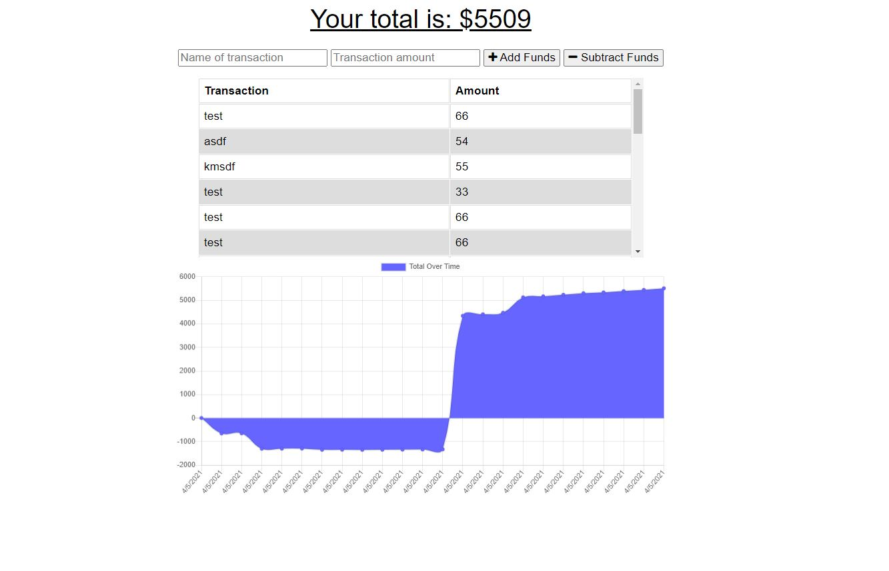

  
  # Online-Offline Budget Tracker

  <h2>Description:</h2> a budgeting tool for keeping track of spending when going on and offline

  <h2>Table of Contents:</h2> 

  [Installation](#install)

  [Usage](#usage)

  [License](#license)

  [Contributing](#contributing)

  [Tests](#tests)

  [Questions](#questions)

  [Screenshot](#screenshot)

  <h3><a name="install">Installation:</a></h3>

  please run npm i 

  <h3><a name="usage">Usage:</a></h3>

  use as you see fit! deployed link (https://powerful-inlet-38809.herokuapp.com/)

  <h3><a name="liscense">License:</a></h3>

  This work is covered under the CC0 1.0 Universal license.

  Full license information can be found here: [License: CC0-1.0](http://creativecommons.org/publicdomain/zero/1.0/)

  <h3><a name="contributing">Contributing:</a></h3> 

  contribute as you see fit

  <a name="tests"><h3>Tests:</h3></a> 

  no test procedures exist at this time

  <a name="questions"><h3>Questions:</h3></a>  

  gitHub Name: forgetfulmind

  gitHub Link: <a href="https://github.com/forgetfulmind">https://github.com/forgetfulmind</a>

  eMail: forgetfulmind@gmail.com

  <a name="screenshot"><h3>Screenshot:</h3></a>  
